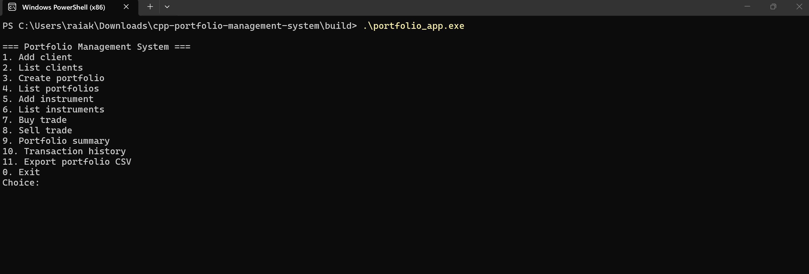
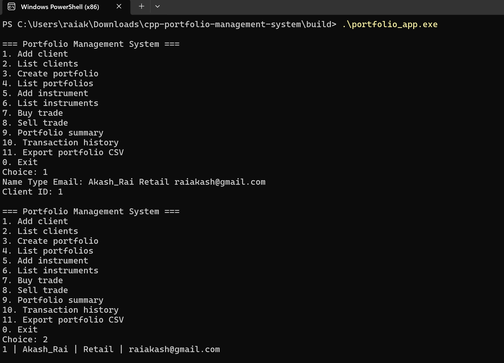
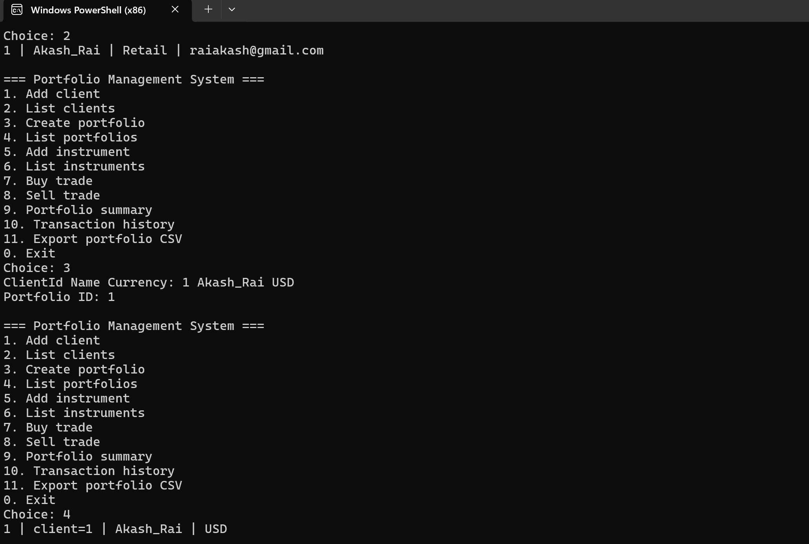
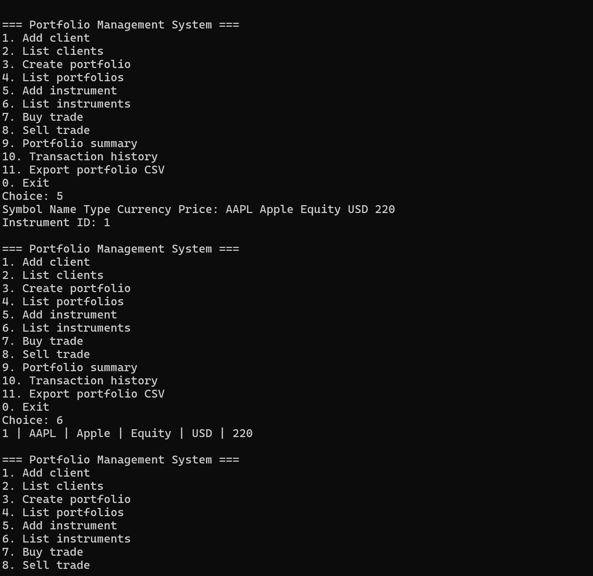
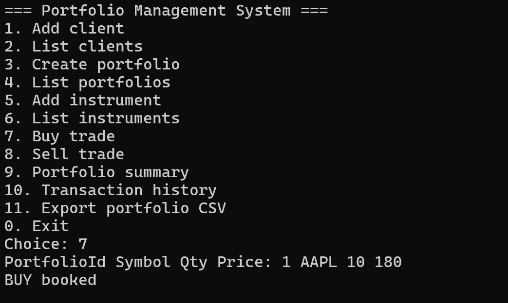
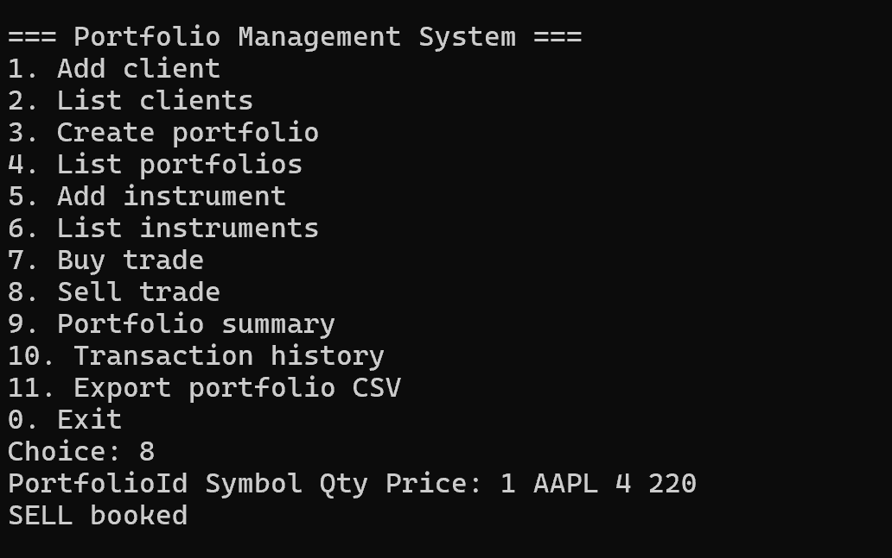
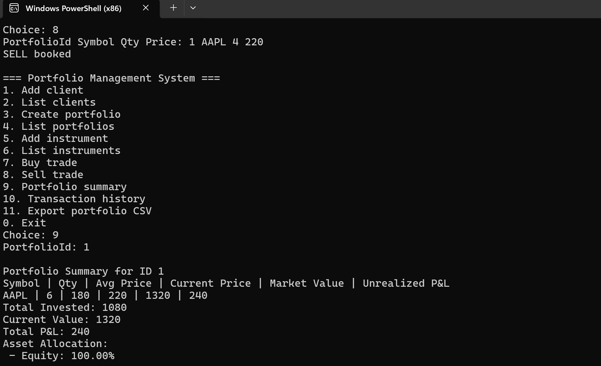
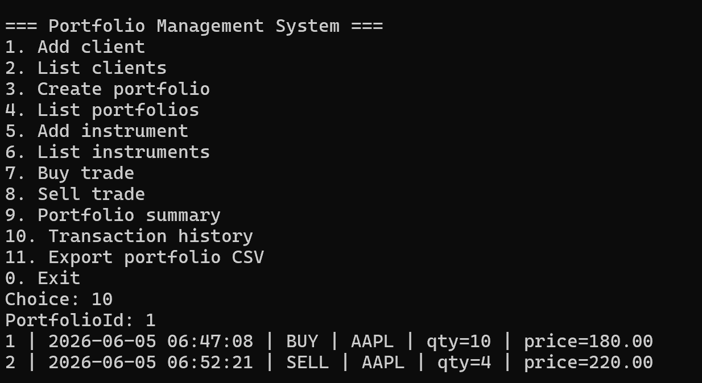
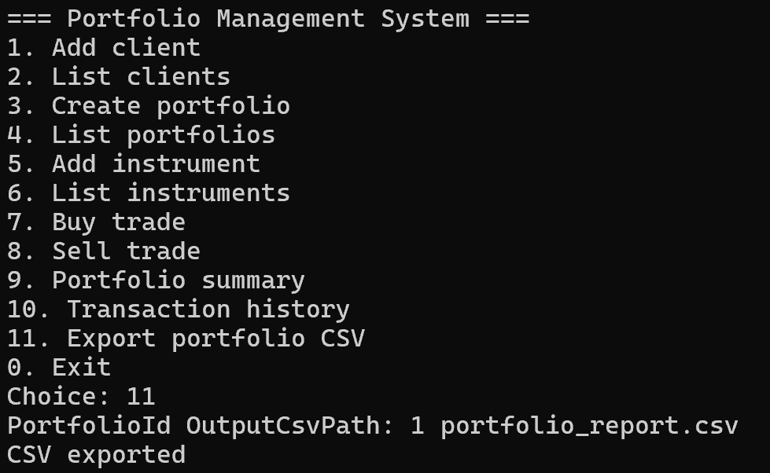
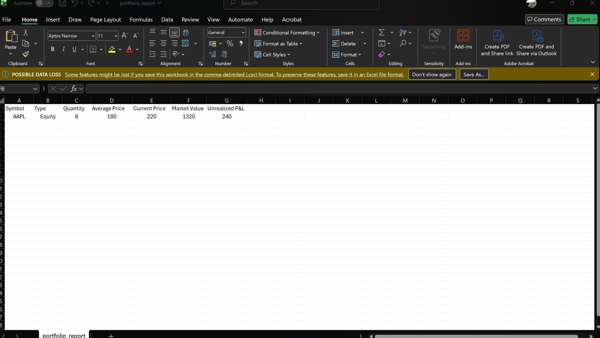

<div align="center">

# C++ Portfolio Management System

[](https://isocpp.org/)
[](https://cmake.org/)
[](https://sqlite.org/)
[](https://docker.com/)
[](LICENSE)
[]()

A C++17 portfolio accounting engine implementing client hierarchy management, atomic trade booking, weighted-average cost basis tracking, mark-to-market valuation, and structured CSV reporting — built on a layered service/repository architecture backed by SQLite.

</div>

---

## Table of Contents

- [Overview](#overview)
- [Screenshots](#screenshots)
- [Architecture](#architecture)
- [Database Design](#database-design)
- [Project Structure](#project-structure)
- [Engineering Decisions](#engineering-decisions)
- [Build](#build)
- [Running](#running)
- [Testing](#testing)
- [Docker](#docker)
- [Valuation Model](#valuation-model)
- [Error Handling](#error-handling)
- [Known Limitations](#known-limitations)
- [Scalability Path](#scalability-path)
- [Resume Statements](#resume-statements)

---

## Overview

This system models the core position-keeping and trade-booking workflows found in institutional portfolio accounting platforms. The domain covers three client segments — Institutional, Retail, and Private Client — each supporting multiple portfolios across four instrument classes: Equity, Bond, Mutual Fund, and ETF.

The primary engineering goals were clean separation of concerns across three layers, ACID-safe trade execution, correct weighted-average cost accounting on the holdings ledger, and a test suite that runs against an in-memory database with no external dependencies.

---

## Screenshots

### Main Menu



---

### Client Management

Add and list clients with type classification: Institutional, Retail, or PrivateClient. Email uniqueness is enforced at the service layer before any database write.



---

### Portfolio Management

Multiple portfolios per client with base currency support. Portfolio creation validates the parent client exists before insertion.



---

### Instrument Management

Add instruments across four types (Equity, Bond, MutualFund, ETF) with live price tracking. Prices can be updated at runtime to simulate a mark-to-market feed.



---

### Buy Trade

BUY trades are executed atomically — transaction record inserted and holdings ledger upserted within a single `BEGIN/COMMIT` block. Weighted-average cost basis is recalculated on each buy across multiple lots.



---

### Sell Trade

SELL pre-flight check validates held quantity before opening the transaction. If `requested > held`, the operation aborts with no database writes.



---

### Portfolio Summary & Valuation

Holdings displayed with quantity, average cost, current price, current value, and unrealized P&L in absolute and percentage terms. Asset allocation breakdown by instrument type computed at query time.



---

### Transaction History

Full trade history per portfolio ordered by trade date. Filterable by side (BUY/SELL), symbol, and date range.



---

### CSV Report

Portfolio-level CSV export via `CsvWriter` utility. Output includes one row per holding with all valuation fields and a summary footer.



---

### CSV Report File

Generated CSV file showing holdings, invested value, current value, unrealized P&L, and asset allocation — suitable for downstream analysis or client reporting.



---

## Architecture

```
┌─────────────────────────────────────────────────────────────┐
│  CLI  —  src/main.cpp                                        │
│  REPL loop, command dispatch, formatted terminal output      │
└────────────────────────┬────────────────────────────────────┘
                         │  calls
┌────────────────────────▼────────────────────────────────────┐
│  Service Layer                                               │
│                                                              │
│  ClientService      PortfolioService    InstrumentService    │
│  TradeService       ReportService                            │
│                                                              │
│  Owns validation, business rules, transaction boundaries.    │
│  No SQL. No I/O. Calls repositories via injected pointers.   │
└────────────────────────┬────────────────────────────────────┘
                         │  calls
┌────────────────────────▼────────────────────────────────────┐
│  Repository Layer                                            │
│                                                              │
│  ClientRepository    PortfolioRepository                     │
│  InstrumentRepository  TransactionRepository                 │
│  HoldingRepository                                           │
│                                                              │
│  SQL only. Owns row-to-object mapping. Zero business logic.  │
└────────────────────────┬────────────────────────────────────┘
                         │  calls
┌────────────────────────▼────────────────────────────────────┐
│  utils/Database.cpp                                          │
│  RAII sqlite3 wrapper. Connection lifetime, statement        │
│  preparation, WAL mode, FK pragma enforcement.               │
└────────────────────────┬────────────────────────────────────┘
                         │
                  portfolio.db  (SQLite WAL)
```

**Data flow — BUY trade:**

```
CLI: buy <portfolio_id> <symbol> <qty> <price>
  │
  ▼
TradeService::buy()
  ├─ validate qty > 0, price > 0
  ├─ PortfolioRepository::findById()        — confirm portfolio exists
  ├─ InstrumentRepository::findBySymbol()   — resolve instrument_id
  ├─ Database::beginTransaction()
  │    ├─ TransactionRepository::insert()   — append-only audit record
  │    └─ HoldingRepository::upsert()       — weighted avg recalc on ledger
  └─ Database::commit()  /  rollback() on any exception
```

**Data flow — SELL trade:**

```
CLI: sell <portfolio_id> <symbol> <qty> <price>
  │
  ▼
TradeService::sell()
  ├─ validate qty > 0, price > 0
  ├─ InstrumentRepository::findBySymbol()
  ├─ HoldingRepository::getQuantity()       — pre-trade check, BEFORE any DB write
  ├─ if qty_held < qty_requested → throw    — fail fast, zero state mutation
  ├─ Database::beginTransaction()
  │    ├─ TransactionRepository::insert()
  │    └─ HoldingRepository::reducePosition()
  └─ Database::commit()  /  rollback() on any exception
```

---

## Database Design

Five normalized tables. The central design decision is the separation of `transactions` (immutable append-only audit log) from `holdings` (mutable position ledger). These serve different purposes and must not be collapsed.

```
clients
  id            INTEGER  PK AUTOINCREMENT
  name          TEXT     NOT NULL
  email         TEXT     NOT NULL UNIQUE
  phone         TEXT
  client_type   TEXT     CHECK('Institutional','Retail','PrivateClient')
  created_at    TEXT     DEFAULT datetime('now')

portfolios
  id            INTEGER  PK AUTOINCREMENT
  client_id     INTEGER  FK → clients.id  ON DELETE CASCADE
  name          TEXT     NOT NULL
  base_currency TEXT     DEFAULT 'USD'
  created_at    TEXT     DEFAULT datetime('now')

instruments
  id              INTEGER  PK AUTOINCREMENT
  symbol          TEXT     NOT NULL UNIQUE
  name            TEXT     NOT NULL
  type            TEXT     CHECK('Equity','Bond','MutualFund','ETF')
  currency        TEXT     DEFAULT 'USD'
  current_price   REAL     NOT NULL
  updated_at      TEXT     DEFAULT datetime('now')

transactions                            ← append-only, never updated
  id              INTEGER  PK AUTOINCREMENT
  portfolio_id    INTEGER  FK → portfolios.id
  instrument_id   INTEGER  FK → instruments.id
  side            TEXT     CHECK('BUY','SELL')
  quantity        REAL     NOT NULL
  price           REAL     NOT NULL
  trade_date      TEXT     DEFAULT datetime('now')

holdings                                ← mutable position ledger, upserted on each trade
  id              INTEGER  PK AUTOINCREMENT
  portfolio_id    INTEGER  FK → portfolios.id
  instrument_id   INTEGER  FK → instruments.id
  quantity        REAL     NOT NULL DEFAULT 0
  average_price   REAL     NOT NULL DEFAULT 0
  UNIQUE(portfolio_id, instrument_id)
```

**Why this separation matters.** `transactions` is the source of truth for what happened and when — it is never modified after insert. `holdings` is a derived aggregate maintained in sync by `TradeService`. If `holdings` were ever corrupted or needed recalculation, it could be fully reconstructed by replaying `transactions` in chronological order. This is the same principle underlying event-sourced ledger systems.

**Weighted-average cost basis on BUY:**
```
new_avg_price = (old_quantity × old_avg + new_quantity × trade_price)
                ÷ (old_quantity + new_quantity)
```

On SELL, `average_price` is unchanged — the cost basis of remaining shares does not change when shares are sold. This matches standard portfolio accounting behaviour.

**`UNIQUE(portfolio_id, instrument_id)` on holdings** enforces that a portfolio holds exactly one position per instrument regardless of application logic. The database constraint is the last line of defence.

---

## Project Structure

```
cpp-portfolio-management-system/
├── CMakeLists.txt
├── Dockerfile
├── LICENSE
├── README.md
├── .vscode-settings-example.json
│
├── include/
│   ├── models/
│   │   ├── Client.h
│   │   ├── Portfolio.h
│   │   ├── Instrument.h
│   │   ├── Transaction.h
│   │   └── Holding.h
│   ├── repositories/
│   │   ├── ClientRepository.h
│   │   ├── PortfolioRepository.h
│   │   ├── InstrumentRepository.h
│   │   ├── TransactionRepository.h
│   │   └── HoldingRepository.h
│   ├── services/
│   │   ├── ClientService.h
│   │   ├── PortfolioService.h
│   │   ├── InstrumentService.h
│   │   ├── TradeService.h
│   │   └── ReportService.h
│   └── utils/
│       ├── Database.h
│       └── CsvWriter.h
│
├── src/
│   ├── main.cpp
│   ├── utils/
│   │   ├── Database.cpp
│   │   └── CsvWriter.cpp
│   ├── repositories/
│   │   ├── ClientRepository.cpp
│   │   ├── PortfolioRepository.cpp
│   │   ├── InstrumentRepository.cpp
│   │   ├── TransactionRepository.cpp
│   │   └── HoldingRepository.cpp
│   └── services/
│       ├── ClientService.cpp
│       ├── PortfolioService.cpp
│       ├── InstrumentService.cpp
│       ├── TradeService.cpp
│       └── ReportService.cpp
│
├── sql/
│   ├── schema.sql
│   └── seed.sql
│
├── tests/
│   └── test_portfolio.cpp
│
└── docs/
    └── screenshots/
        ├── main-menu.png
        ├── client-management.png
        ├── portfolio-management.png
        ├── instrument-management.png
        ├── buy-trade.png
        ├── sell-trade.png
        ├── portfolio-summary.png
        ├── transaction-history.png
        ├── export-csv.png
        └── csv-report.png
```

---

## Engineering Decisions

**SQLite over PostgreSQL.** SQLite is embedded — zero deployment overhead, no connection management, runs in Docker with a single binary. The repository layer fully abstracts the database; replacing SQLite with PostgreSQL requires rewriting `Database.cpp` and the connection string, not the services or tests. SQLite in WAL mode handles the read/write concurrency of a single-node CLI process without contention.

**Repository pattern.** Services must not contain SQL. SQL must not contain business logic. Keeping these strictly separate means: (1) services are testable by substituting a repository; (2) SQL query changes do not require touching validation rules; (3) the schema can evolve independently of domain logic. Each repository owns exactly one table's access pattern.

**Pre-trade validation before `BEGIN TRANSACTION` on sells.** The quantity check fires before the write lock is acquired. This is intentional — it avoids opening a transaction only to immediately abort with a predictable failure. Application-layer fail-fast is cheaper than database-layer constraint violation on a hot path.

**Append-only `transactions` table.** Modifying a past transaction record is a data integrity violation in any accounting context. `transactions` records what was booked and when. If `holdings` ever diverges from `transactions`, `transactions` wins and `holdings` is rebuilt by replay.

**`COMMON_SOURCES` compiled into both targets.** The CMakeLists compiles the source list into `portfolio_app` and `portfolio_tests` directly rather than into a shared static library. This keeps the build script flat at the cost of compiling all sources twice. At this codebase size the incremental build time difference is negligible. A `pms_core` static library target would be the correct refactor at scale.

**`CsvWriter` as a dedicated utility class.** CSV serialisation is separated from `ReportService` into its own utility. `ReportService` owns what data to export; `CsvWriter` owns how to write it. This keeps format-specific logic out of the service layer and makes it easy to add XLSX or JSON output without touching reporting logic.

---

## Build

**Prerequisites:**

| Tool | Version |
|---|---|
| GCC or Clang | GCC 9+ / Clang 10+ |
| CMake | 3.16+ |
| SQLite3 dev headers | 3.x |

```bash
# Ubuntu / Debian
sudo apt-get update && sudo apt-get install -y \
    build-essential cmake libsqlite3-dev

# Clone
git clone https://github.com/sky9891/cpp-portfolio-management-system.git
cd cpp-portfolio-management-system

# Configure and build
mkdir -p build && cd build
cmake .. -DCMAKE_BUILD_TYPE=Release
cmake --build . --parallel

# Binaries:
#   build/portfolio_app     — main CLI
#   build/portfolio_tests   — test runner
```

**macOS:**
```bash
brew install cmake sqlite3
mkdir -p build && cd build
cmake .. -DCMAKE_BUILD_TYPE=Release
cmake --build . --parallel
```

**Windows:** Use WSL2 with Ubuntu 22.04 or 24.04. Native MSVC builds are untested.

---

## Running

```bash
cd build

# Start with an empty database
./portfolio_app

# Pre-load sample data (5 clients, 6 portfolios, 12 instruments)
sqlite3 portfolio.db < ../sql/seed.sql
./portfolio_app
```

---

## Testing

Tests are self-contained in `tests/test_portfolio.cpp`. Each test creates a fresh in-memory SQLite database (`:memory:`), applies the schema inline, runs through the full service → repository → SQLite stack, and asserts outcomes. No shared state between tests, no file I/O, no external framework required.

```bash
cd build
./portfolio_tests
```

Expected output:
```
All portfolio core tests passed.
```

**Coverage:**

| Area | Scenarios |
|---|---|
| Client | Create, duplicate email rejection, not-found |
| Portfolio | Create, invalid client ID, multiple per client |
| Instrument | Create, duplicate symbol, price update |
| Trade — Buy | Position creation, weighted avg recalc across multiple lots |
| Trade — Sell | Position reduction, pre-trade quantity validation |
| Trade — Error paths | Sell exceeds holding, sell with no position, negative quantity |
| Valuation | P&L calculation, allocation by type, empty portfolio |
| Transaction history | Count accuracy, filter by side |

Tests run against the full stack — not mocked repositories — because the primary risk in an accounting system is incorrect SQL and incorrect numerical calculations, not service orchestration in isolation.

---

## Docker

```bash
# Build — compiles the project inside ubuntu:24.04
docker build -t cpp-pms:latest .

# Run interactive CLI
docker run -it --rm cpp-pms:latest

# Persist the database across container runs
docker run -it --rm \
    -v $(pwd)/data:/app/build \
    cpp-pms:latest
```

The current Dockerfile is single-stage: GCC, CMake, and build artefacts remain in the final image (~400 MB). A two-stage build would reduce this to under 30 MB by compiling in a `builder` stage and copying only `portfolio_app` and `sql/` into a clean runtime stage.

---

## Valuation Model

Portfolio valuation is computed at query time by joining the `holdings` ledger against `instruments.current_price`. Nothing is stored — it is always derived from live data.

```
For each holding in portfolio:
  invested_value  = quantity × average_price
  current_value   = quantity × instruments.current_price
  unrealized_pnl  = current_value − invested_value
  pnl_percent     = (unrealized_pnl / invested_value) × 100

Portfolio totals:
  total_invested  = Σ holding.invested_value
  total_current   = Σ holding.current_value
  total_pnl       = total_current − total_invested
  allocation[T]   = (Σ current_value where instrument.type = T) / total_current × 100
```

`current_price` acts as a manual mark-to-market feed. In a production system this column is updated by a price ingestion service consuming a market data source (FIX, WebSocket, REST). The valuation query itself does not change regardless of how prices are sourced.

---

## Error Handling

Three categories of errors, all surfaced as C++ exceptions caught at the CLI dispatch level:

- **`std::invalid_argument`** — input validation failures (negative quantity, empty symbol, unrecognised type string). Thrown before any database interaction.
- **`std::runtime_error`** — business rule violations (insufficient holdings, duplicate entity, not-found lookups). Thrown after a confirming database read.
- **Database errors** — `Database::execute()` and `prepare()` wrap sqlite3 error strings in `std::runtime_error`. `TradeService` catches all exceptions inside the transaction block, calls `rollback()`, then rethrows.

The REPL catches `std::exception` at the dispatch boundary, prints the message, and continues. The process never exits on a domain error.

---

## Known Limitations

| Area | Detail |
|---|---|
| Realized P&L | Selling a position does not book a gain/loss record. Closed position cost basis is not retained. |
| Tax lot accounting | No FIFO, LIFO, or specific-lot identification. All shares of a symbol share one average cost. |
| Corporate actions | No dividend reinvestment, splits, mergers, or spinoffs. |
| Settlement | Trades are booked as immediately settled. T+1/T+2 cycles are not modelled. |
| Multi-currency FX | Positions stored in instrument currency. No FX conversion to a base currency. |
| Concurrent writes | SQLite WAL handles concurrent reads. Multi-process concurrent writes require a PostgreSQL backend. |

These are deliberate scope boundaries, not oversights.

---

## Scalability Path

| Current | Production path |
|---|---|
| SQLite embedded | PostgreSQL with `libpqxx`, connection pool |
| Single-stage Dockerfile | Multi-stage build, `<30 MB` runtime image |
| CLI REPL | REST API via Crow or Drogon, OpenAPI spec |
| Manual price update | Market data ingestion via WebSocket or FIX |
| Sources compiled twice | Extract `pms_core` static library in CMake |
| No CI | GitHub Actions: build matrix, test on push, Docker publish |
| Single process | Separate read service on read replica for reporting |
| No auth | JWT session management, RBAC per client segment |

---

## Resume Statements

```
C++ Portfolio Management System — C++17 · SQLite · CMake · Docker · Linux

• Designed and implemented a layered portfolio accounting engine in C++17 covering
  trade booking, holdings ledger maintenance, and mark-to-market P&L valuation
  across institutional, retail, and private client account types.

• Built atomic BUY/SELL trade processing with ACID-compliant SQLite transactions,
  pre-trade holdings validation, and automatic rollback on failure — holdings and
  transaction tables kept consistent under all error conditions.

• Implemented weighted-average cost basis recalculation on each BUY across multiple
  lots; sell-side quantity validation enforced before any database write.

• Structured codebase in a strict service/repository/model architecture: services own
  business rules and transaction boundaries, repositories own SQL, models are pure
  data — enabling test isolation and straightforward database substitution.

• Wrote a zero-dependency test suite running against in-memory SQLite, covering trade
  logic, P&L arithmetic, error paths, and transaction history filtering.
```

---

## License

MIT — see [LICENSE](LICENSE).
